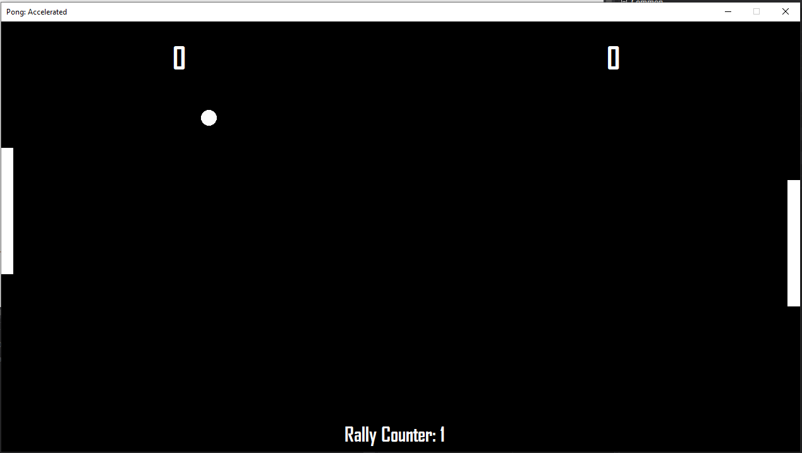

# Pong: Accelerated

 A 2P C# Game of Pong with a Twist!

This project was created as part of the course DA204E Programming in C#. It takes the classic game of pong however it adds elements that make it more thrilling to play. The ball will accelerate with every strike and the paddles will shrink! Challenge your friends to an old classic game when you're tired of cat videos online :)

Controls:
----------------------
SPACE: Start game

W: P1 UP  
S: P1 UP  
  
↑ : P2 UP  
↓ : P2 Down  

----------------------

Changelog:  
---------
- v0.6  
  - Added transfer of momentum from paddle so the ball does not move in a constant y-speed.  
  
  
Link to game: [Google Drive](https://drive.google.com/file/d/1wZLOX99HqW2BcAvPkdyCKlVX0FvU00Po/view?usp=sharing)
